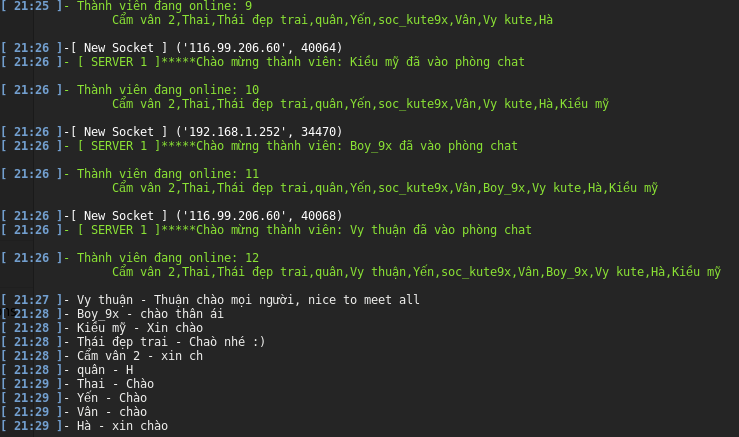
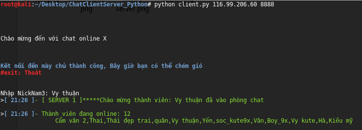

<h1>MÔN PHÁT TRIỂN PHẦN MỀM NGUỒN MỞ (4305)</h1>
<h1>Tên đề tài : Xây dựng ứng dụng chat Online</h1>

<h2>Một số Hình Ảnh về sản Phẩm:</h2>
 

<h2>Thành viên:</h2>
  1.Nguyễn Đình Thái (Trưởng nhóm)
 Email: thai.itplus@gmail.com
 2.Trịnh Văn Bình (Đồng tác giả)</a>
 Email: binhboibac.dhttll@gmail.com

<h1>I.Lời nói đầu</h1>
<h2>Phần mềm nguồn mở:</h2>

Phần mềm nguồn mở là những phần mềm được cung cấp dưới cả dạng mã và nguồn, không chỉ là miễn phí về giá mua mà chủ yếu là miễn phí về bản quyền: người dùng có quyền sửa đổi, cải tiến, phát triển, nâng cấp theo một số nguyên tắc chung quy định trong giấy phép phần mềm nguồn mở (General Public Licence - GPL) mà không cần xin phép ai, điều mà họ không được phép làm đối với các phần mềm nguồn đóng (tức là phần mềm thương mại)… nhìn chung, thuật ngữ “Open source” được dùng để lôi cuốn các nhà kinh doanh, một điều thuận lợi chính là sự miễn phí và cho phép người dùng có quyền sở hữu hệ thống.

<h2>Lợi ích phần mềm nguồn mở </h2>

 Hiện nay, PMNM đã và đang thu hút được sự chú ý mạnh mẽ của cộng đồng, và số lượng phần mềm cũng như người dùng đã tăng lên một cách đáng kể. Những lợi ích dưới đây do phần mềm nguồn mở mang lại chắc chắn sẽ khiến bạn, nếu chưa sử dụng, nên suy nghĩ để lựa chọn giữa phần mềm thương mại và phần mềm mở.
  Lợi ích lớn nhất trong việc chuyển đổi sang phần mềm tự do nguồn mở là giảm tổng chi phí sở hữu, từ các yếu tố sau:
 - Miễn phí bản quyền phần mềm
 - Miễn phí các phiên bản nâng cấp trong toàn bộ vòng đời sử dụng sản phẩm
 - Giảm chi phí phát triển phần mềm đáp ứng theo yêu cầu nghiệp vụ (sử dụng phần mềm, mô-đun có sẵn để phát triển tiếp, sửa đổi điều  chỉnh cho phù hợp với nghiệp vụ)
 - Kéo dài thời gian sử dụng/tái sử dụng các phần cứng, thiết bị trong khi vẫn đảm bảo hiệu năng toàn hệ thống
 - Chi phí đầu tư, vận hành hệ thống tập trung cho các dịch vụ “hữu hình” đem lại giá trị trực tiếp, thiết thực cho tổ chức như: tư vấn, sửa đổi theo yêu cầu, triển khai, đào tạo, bảo trì, nâng cấp hệ thống...
 - Mức chi phí tiết kiệm khoảng 75-80% so với phần mềm license ngay trong năm đầu tiên.
 Giảm tối đa sự phụ thuộc vào một vài nhà cung cấp phần mềm dẫn đến dịch vụ kém (do không có cạnh tranh), hoặc “bị ép” trong các trường hợp cần đàm phán về chi phí, dịch vụ (mỗi FLOSS có thể có nhiều nhà cung cấp dịch vụ tương tự), nâng cấp phần mềm, mở rộng hệ thống (với mã nguồn trong tay, có thể dễ dàng nâng cấp, mở rộng hệ thống theo yêu cầu trong mỗi giai đoạn phát triển).
 Đối với các hệ thống đang hoạt động, chủ động thực hiện chuyển đổi sẽ tránh được “nguy cơ” bị phạt vi phạm bản quyền và/hoặc bị “bắt buộc” mua license.
 Tăng tính thương hiệu cho doanh nghiệp khi giới thiệu được với cộng đồng, đối tác, khách hàng (đặc biệt là ngoài nước) là chúng tôi đã chuyển đổi thành công và 100% không vi phạm bản quyền.
 Tăng cường độ tin cậy (có thể kiểm chứng không có mã độc, “cửa sau”... với mã nguồn được phân phối kèm), ổn định (tuân theo các chuẩn mở ứng dụng lâu dài), tính an toàn, bảo mật (theo báo cáo của Gartner & nhiều tổ chức phân tích độc lập) toàn hệ thống.
xem thêm thông tin ở <a href="http://www.iwayvietnam.com/nguonmo/loi-ich-phan-mem-nguon-mo.html"> đây </a> 

<h2>II. Mục tiêu Đề tài & Định hướng phát triển</h2>

<h3>1: Mục tiêu Đề tài:</h3>	
Mục tiêu của đề tài nhằm tạo ra 1 ứng dụng chat nhóm giữa các thành viên với nhau, 
 Giúp trao đổi thông tin giữa các client trong nội bộ mạng LAN (trong 1 công ty, một tổ chức, trường đại học,...), huặc qua mạng Internet, nhằm giúp kết nối mọi người lại với nhau ở mọi khoảng cách địa lý, 
 Ứng dụng giúp mọi người có thể trò chuyện, tán gẫu, chém gió sau những khoảng thời gian làm việc căng thẳng.
 Cho phép các client có thể chat trực tiếp với nhau,không cần đăng ký tài khoản, không phân biệt tuổi tác, trình độ học vấn,.Ai cũng có thể sử dụng được!!!

<h3>2: Nền tảng hỗ trợ:</h3>
  Ứng dụng được nhóm tác giả xây dựng bằng ngôn ngữ python,một ngôn ngữ nguồn mở, một ngôn ngữ trong sáng dể hiểu.
  Ứng dụng chat được thiết kế cho phép chạy trên Nền tảng Linux, một nền tảng mã nguồn mở và miễn phí
  Danh sách các bản phân phối của Linux: Kali Linux,Ubuntu,Fedora,CentOS,Linux Mint,...

<h3>3: Hướng phát triển trong tương lai:</h3>
 	Triển khai trên nhiều nhiều hệ điều hành: Windows, Mac-OS
  	Đảm bảo bảo mật thông tin cho các client
  	Cho phép gửi file giữa các client
  	Cho phép triển khai nhiều kênh chat riêng, Hỗ trợ số lượng lớn client chat cũng lúc
  	Giao diện trực quan,dễ sử dụng

<h1>III.Tác giả & Liên Hệ:</h1>
<h2> 1: Thông tin Nhóm Tác Giả: </h2>
Mọi chi tiết đóng góp xin vui lòng liện hệ: IT-PLUS TEAM
 <a href="https://www.facebook.com/itplussln/"> Facebook </a>
 <a href="https://twitter.com/kkids1412"> Twitter </a>
  Email: thai.itplus@gmail.com

<h3>2: Cộng tác viên:</h3>
 Nhóm rất sẵn lòng nếu ai đó muốn trở thành cộng tác viên để cùng định hướng,phát triển ứng dụng.

<h2>3: Truyền thông: </h2>
Mọi thắc mắc về ứng dụng,trao đổi thông tin
đóng góp mã nguồn,làm cộng tác viên... xin vui lòng liên hệ IT-PLUS TEAM tại <a href="https://www.facebook.com/itplussln/">đây</a>

<h1>IV. Tài liệu:</h1>

<h2>1: Tài liệu cho người dùng cuối:</h2>
Xem tài liệu người dùng cuối ở <a href="https://drive.google.com/file/d/0BxCvIBgbzyu7TW5QRlJ5a2x2S3c/view?usp=sharing">đây</a>

<h2>2: Tài liệu cho nhà phát triển: </h2>
Xem tài liệu cho nhà phát triển tại <a href="https://drive.google.com/file/d/0BzFhBdZmpSNKQ3dpQ2Z6NW5lVmc/view?usp=sharing">đây</a>

<h2>3: Tài liệu thiết kế: </h2>
Xem tài liệu thiết kế chi tiết tại <a href="https://drive.google.com/file/d/0BzFhBdZmpSNKXzRjR1pueWdlNVk/view?usp=sharing">đây</a>

<h1>V. Phần mềm & Bản quyền:</h1>

<h2>Một số Hình Ảnh về sản Phẩm:</h2>

 <a href="https://www.youtube.com/watch?v=wXUi4oppHgo">Video</a>giới thiệu ứng dụng
 Lịch sử phiên bản: xem tại <a href="https://github.com/TCU1/ChatClientServer_Python/blob/master/Readme/version.md">đây</a>

<h2>1: Mô hình triển khai & chuẩn mực lập trình: </h2>
xem tại <a href="https://github.com/TCU1/ChatClientServer_Python/blob/master/Readme/programming.md">đây</a>

<h2>2: Danh sách lỗi: </h2>
Xem danh sách lỗi ở <a href="https://github.com/TCU1/ChatClientServer_Python/blob/master/Readme/issues.md">đây</a>

<h2>3: Giấy phép sử dụng: </h2>
Thông tin giấy phép ở <a href="https://drive.google.com/file/d/0BxCvIBgbzyu7eU9kOTlOSkdGUEE/view?usp=sharing">đây</a>

<h2>4: Bản quyền tác giả: </h2>
Bản quyền ® thuộc về ITPLUS TEAM
Xem các chính sách ở <a href="https://github.com/TCU1/ChatClientServer_Python/blob/master/Readme/copyright.md">đây</a>

<h1>VI: Kết thúc: </h1>
<h2>3: Lời Cảm ơn: </h2>
Để xây dựng ứng dụng "chat client" nhóm đã áp dụng khá nhiều kiến thức Lập trình, Xây dựng mô hình, Phân công nhiệm vụ, Học hỏi từ nhiều nguồn, xin cảm ơn thầy Mai Cường Thọ – giảng viên khoa CNTT Trường Đại học Nha Trang,Khoa Mạng Máy Tính đã giúp đỡ, tạo điều kiện thuận lợi để nhóm phát triển sản phẩm & hoàn thành đề tài!!!

